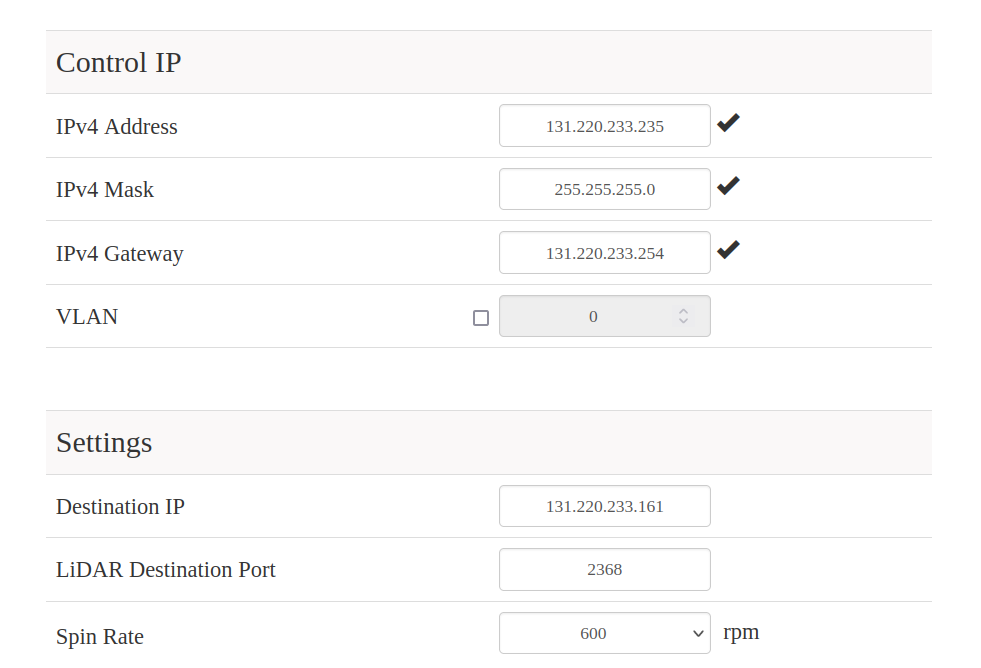

# hesai_docker
This docker contains ROS1 package of the hesai lidar. Use ROS1-ROS2 bridge docker to bridge lidar messages in ROS1 to ROS2 network.

Step 0: Inspect Lidar WebPage
```
http://131.220.233.235/
```
make sure that ip address of the lidar and the computer are in the same network iPv4 range 


and confirm if receiving address is correct by using 
```
ifconfig
```

Step 1: Assuming that the image is built using the make file, Create a docker container using the make file in the repo home directoty
```
make up
```

Step 2: Run the launch file specific to your robot configuration, for ipb-alfredo
```
make launch_hesai_lidar_alfredo
# This launch file is part of the cofig folder, this contains lidar iPv4 cofiguration - check this if you receive no messages
```

Step 3: You can now receive ROS1 topics in the host pc and the docker container. 
```
# To view Lidar data in RViz in the host machine, run the following before launching a GUI
xhost +
```
